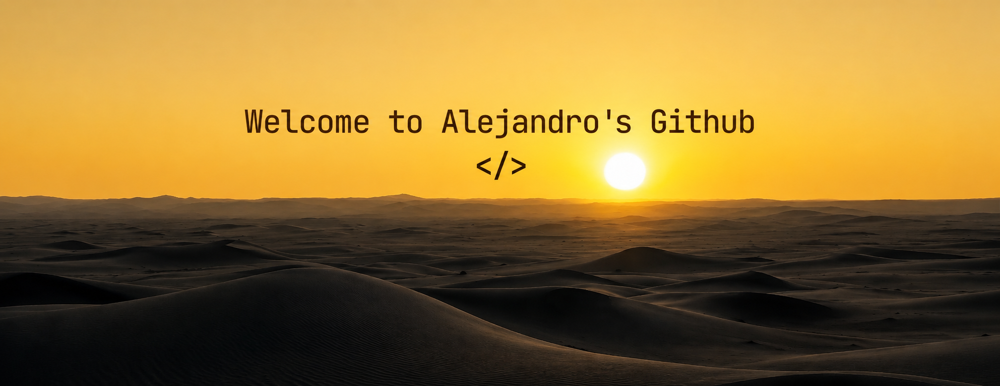

  

  
  
  

<h2 align="center"><i>Technologies</i></h2>

  
  
  
  
  
  
  
  
  
  
  
  
  
  
  
  
  

<h2 align="center"><i>Statistics</i> </h2>

  

 

<h2 align="center"> <i>About Me & Hobbies</i> </h2>

  Hello! My name is <b>Alejandro Noguera</b>, and I am a Software Engineering student. I am passionate about learning new technologies, developing innovative projects, and solving complex problems through programming. Currently, I am honing my skills in <b>JavaScript, React.js, Java, Spring Boot, and SQL</b>, focusing on building robust applications and continuously growing within the tech industry.

  Software Engineering student at Fametro.  
  <i>"A man without studies is an incomplete being"</i> — <b>Simón Bolívar</b>.

 

